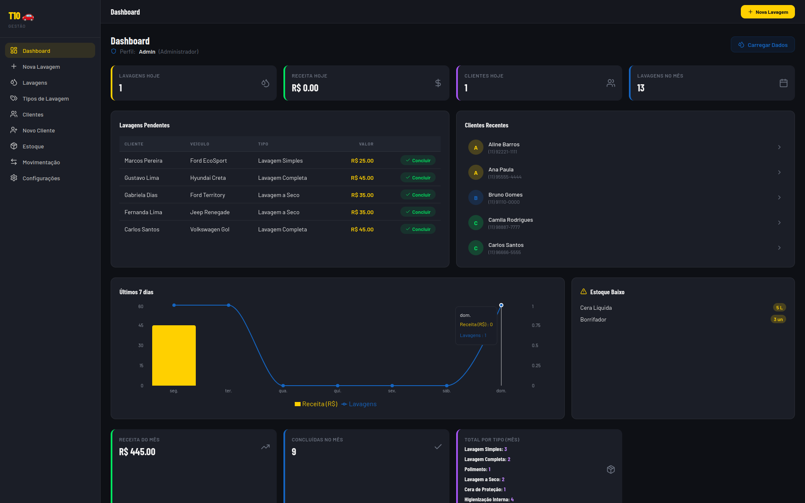
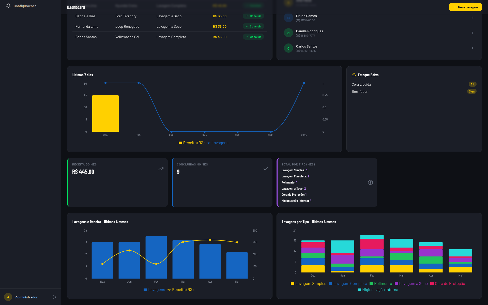
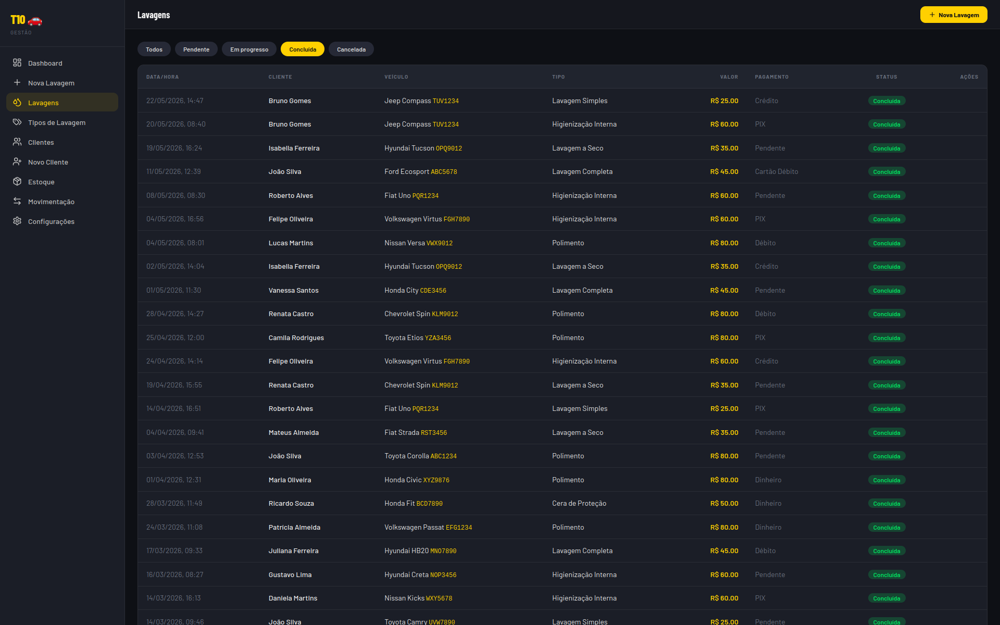
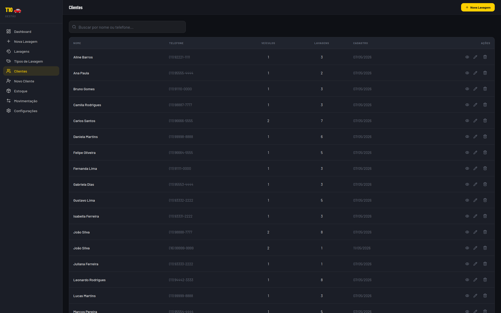
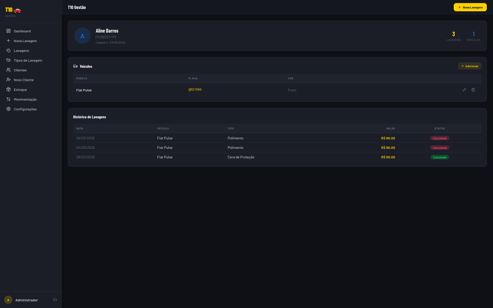

# 🌊 Wash Wizard 
**Sistema Avançado de Gestão para Lava-Rápidos**  
*Versão Acadêmica & Empresarial (Arquitetura Local / SQLite)*

[](https://reactjs.org/)
[](https://nodejs.org/)
[](https://www.sqlite.org/)
[](#)

---

O **Wash Wizard** é um sistema *full-stack* robusto desenvolvido para otimizar as operações de centros de estética automotiva e lava-rápidos. Originalmente projetado para o **Projeto Integrador da UNIVESP (Engenharia de Computação)**, esta versão implementa uma arquitetura 100% local e assíncrona, eliminando dependências de nuvem e garantindo resiliência offline, alta performance e portabilidade através de SQLite e sincronização local por arquivos CSV.

📄 **[Acesse a Documentação Gráfica Completa (docs.html)](./docs.html)**

---

## 📑 Índice

1. [Visão Geral e Funcionalidades](#-visão-geral-e-funcionalidades)
2. [Arquitetura de Software](#-arquitetura-de-software)
3. [Stack Tecnológico](#-stack-tecnológico)
4. [Estrutura do Repositório](#-estrutura-do-repositório)
5. [Guia de Inicialização](#-guia-de-inicialização)
6. [Gerenciamento de Banco de Dados e Backups](#-gerenciamento-de-banco-de-dados-e-backups)
7. [Segurança e Autenticação](#-segurança-e-autenticação)
8. [Próximos Passos](#-próximos-passos)
9. [Autores e Licença](#-autores-e-licença)

---

## 🚀 Visão Geral e Funcionalidades

O sistema provê o controle ponta-a-ponta do fluxo operacional:

- **Gestão de Clientes e Veículos:** Cadastro unificado mantendo integridade relacional rigorosa.
- **Controle de Lavagens (Workflow):** Acompanhamento de status (Pendente, Em Progresso, Concluído, Cancelado).
- **Gestão de Estoque:** Controle de inventário, produtos e alertas automáticos de baixo estoque.
- **Dashboard Financeiro:** Visualização gráfica de faturamento, tickets médios e estatísticas com métricas interativas (via Recharts).
- **Sistema de Backup Resiliente:** Importação e exportação modular de dados via CSV.
- **RBAC (Role-Based Access Control):** Controles estritos entre níveis operacionais (Admin vs Operador), reforçados no backend.

---

## 📸 Telas da Aplicação (Demonstração)

Abaixo estão algumas capturas de tela ilustrando a interface da solução, desenvolvida para proporcionar uma ótima experiência e facilidade de gestão:

### Dashboard Principal
Visão financeira e operacional com métricas e gráficos dinâmicos.
<div align="center">
  
  
</div>

### Gestão de Lavagens
Painel para acompanhamento de status de serviços.
<div align="center">
  
</div>

### Gestão de Clientes
Listagem completa e painel de edição detalhado do cliente e seus veículos.
<div align="center">
  
  
</div>

---

## 📐 Arquitetura de Software

A aplicação utiliza o padrão **Client-Server** num repositório *Monorepo*, orquestrado por scripts inter-dependentes.

```text
[Frontend: React 18 SPA] <---(REST API JSON / Porta 3001)---> [Backend: Node.js + Express]
         |                                                            |
(Vite Dev Server: Porta 8080)                                (SQLite Engine: wash_wizard.db)
```

### Decisões Arquiteturais:
- **Code-Splitting & Lazy Loading:** Para aprimorar os tempos de carregamento, o React faz uso intensivo do `Suspense` e `React.lazy()` no roteamento.
- **Memoização de Componentes:** Uso rigoroso de `useMemo` para mitigar re-renderizações desnecessárias em painéis analíticos complexos.
- **Roteamento Protegido:** O frontend só libera rotas com uma sessão validada contra `GET /api/auth/me`; o backend reforça a mesma regra de forma independente em cada endpoint (ver [Segurança e Autenticação](#-segurança-e-autenticação)).

---

## 💻 Stack Tecnológico

### Frontend
- **React 18** (TypeScript, Componentização e Hooks)
- **Vite** (Build Tool e HMR super rápido)
- **Tailwind CSS** & **shadcn/ui** (Design System modular e estilização utility-first)
- **TanStack React Query** (Sincronização Server-State e cache)
- **Recharts** (Visualização Gráfica de Dados)

### Backend
- **Node.js + Express** (Servidor HTTP, Middlewares, Roteamento)
- **SQLite3** (Motor de Banco de Dados Relacional Embutido)
- **jsonwebtoken & bcryptjs** (Autenticação JWT e hash de senhas)
- **Multer & CSV-Parse** (Processamento e ETL de arquivos de backup)

---

## 📁 Estrutura do Repositório

```bash
wash-wizard/
├── frontend/               # Single Page Application (Client-Side)
│   ├── src/
│   │   ├── components/     # UI components (shadcn) e visuais
│   │   ├── pages/          # Rotas principais (Lazy loaded)
│   │   └── services/       # Módulos de conexão com a API
│   ├── vite.config.ts      # Configurações do empacotador
│   └── package.json        
├── backend/                # RESTful API (Server-Side)
│   ├── server.js           # Ponto de entrada, Middlewares e Rotas
│   ├── db.js               # Conexões e inicialização do SQLite
│   ├── config.js           # Segredo JWT e configurações de auth
│   ├── middleware/auth.js  # requireAuth / requireAdmin
│   ├── schema.sql          # DDL e Constraints (versionado no repo — ver nota abaixo)
│   └── package.json        
├── backups/                # Diretório automatizado para exports CSV
├── docs.html               # Documentação interativa
├── ROADMAP.md              # Planejamento da próxima fase (Data Science / Analytics)
├── package.json            # Orquestrador Root (Scripts concurrently)
└── wash_wizard.db          # Arquivo do Banco de Dados Relacional (gerado localmente, não versionado)
```

> **`backend/schema.sql` é versionado no repositório**, ao contrário do arquivo `.db` em si. É a partir dele que `backend/db.js` inicializa o banco do zero (`CREATE TABLE ... IF NOT EXISTS`) na primeira execução, garantindo que um clone limpo do projeto suba sem depender de um dump de dados.

---

## ⚙️ Guia de Inicialização

### Pré-requisitos
- Node.js `v18.0.0` ou superior.
- NPM (Node Package Manager).

### Instalação (Método Monorepo)

O projeto contém um comando unificado para baixar dependências para a raiz, frontend e backend simultaneamente.

```bash
# 1. Clone o repositório
git clone https://github.com/t10-univespsertaozinho/t10-wash-wizard.git
cd t10-wash-wizard

# 2. Instale todas as dependências da infraestrutura
npm run install:all

# 3. Configure as variáveis de ambiente
cp frontend/.env.example frontend/.env
cp backend/.env.example backend/.env
# Edite backend/.env e defina um JWT_SECRET próprio (obrigatório fora de um ambiente
# de desenvolvimento descartável — sem ele, o servidor gera um segredo aleatório a
# cada boot e invalida sessões existentes a cada restart)

# 4. Gere o banco local com dados de exemplo (usuários admin/operador inclusos)
cd backend && node seed.js && cd ..
```

### Inicialização e Ambiente de Desenvolvimento

```bash
# Inicia simultaneamente o Back (3001) e Front (8080)
npm run dev
```
*(Após o servidor Vite inicializar, pressione `o` + `Enter` no terminal para abrir automaticamente a aplicação no navegador)*

**Acessos Locais:**
- **Web App:** `http://localhost:8080`
- **Backend API:** `http://localhost:3001/api`

---

## 🗄️ Gerenciamento de Banco de Dados e Backups

O modelo transacional é estritamente gerenciado no SQLite com `PRAGMA foreign_keys = ON`. A modelagem original, proveniente de serviços em nuvem (como Supabase/Firebase), teve tipagens convertidas para o ambiente local (`UUID` e `Timestamps` manipulados como `TEXT` formato ISO-8601).

### Sistema de Backup (CSV)
Visando portabilidade dos dados, a aplicação dispõe de rotinas de serialização:
- **Exportação (Dump):** O administrador pode emitir artefatos `.csv` que mapeiam integralmente o status relacional.
- **Importação (Restore):** A API injeta registros respeitando estritamente a árvore de dependências do esquema (`Usuários -> Clientes -> Veículos -> Lavagens`), utilizando `BEGIN TRANSACTION` para garantir falha segura sem perda de integridade do modelo.

---

## 🔒 Segurança e Autenticação

A autenticação e a autorização são reforçadas pelo **backend**, não apenas simuladas no cliente:

- **Autenticação JWT:** `POST /api/auth/login` valida a senha contra o hash `bcrypt` armazenado em `users.password_hash` e emite um token JWT (expira em 8h). Toda rota de `/api/*` — exceto o login — exige o header `Authorization: Bearer <token>`, validado pelo middleware `requireAuth`.
- **RBAC (Role-Based Access Control):** aplicado tanto no roteamento do frontend quanto em cada endpoint do backend (`requireAdmin`), então um usuário `operador` não contorna a restrição chamando a API diretamente.
  - **Público:** `/login`
  - **Operador:** Acesso à gestão de Clientes, Veículos, Lavagens e Dashboard `(/)`
  - **Admin:** Acesso adicional a Tipos de Lavagem, Estoque, Movimentações, Usuários e Configurações (Sistema de Backup)
- **CORS restrito:** o backend só aceita requisições da origem definida em `FRONTEND_URL`.
- **Outras proteções:** allowlist de colunas no import de CSV (previne SQL Injection via cabeçalho malicioso), transações atômicas nas movimentações de estoque, e mensagens de erro genéricas ao cliente (o detalhe real do SQLite fica só no log do servidor).

Detalhes completos, incluindo a matriz de permissões por rota, estão em [`SECURITY.md`](./SECURITY.md).

**Credenciais de exemplo (geradas por `backend/seed.js`, senhas configuráveis via `backend/.env`):**
- `admin@washwizard.com` / `admin123` (perfil `admin`)
- `operador@washwizard.com` / `operador123` (perfil `operador`)

---

## 🧭 Próximos Passos

A próxima fase do projeto foca em **Data Science e Analytics Avançado** sobre o histórico já registrado (lavagens, clientes, estoque): pipelines de ETL para um datamart analítico (Parquet/DuckDB), métricas como churn, LTV e tempo médio de atendimento, e modelos preditivos de demanda, gestão de estoque e segmentação de clientes (RFM).

Plano detalhado, com sequenciamento e dependências técnicas sugeridas, em [`ROADMAP.md`](./ROADMAP.md).

---

## 🎓 Autores e Licença

Desenvolvido pelo grupo acadêmico do **Projeto Integrador da UNIVESP**.

*Este código e seus ativos são de propriedade exclusiva para fins acadêmicos e para a instituição parceira de aplicação do projeto (Lava Rápido Maquininha). É expressamente proibida a reprodução, comercialização ou re-licenciamento deste software sob quaisquer circunstâncias sem a autorização prévia de todos os mantenedores originários.*
