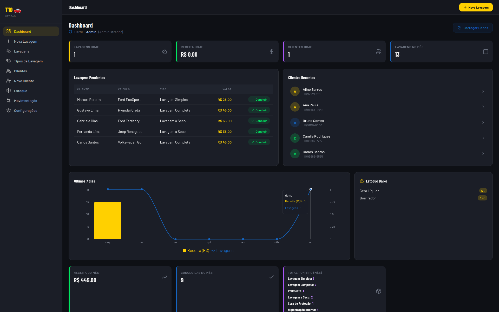
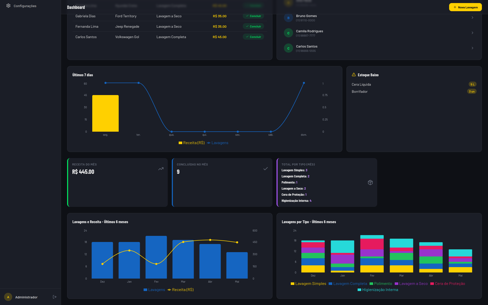
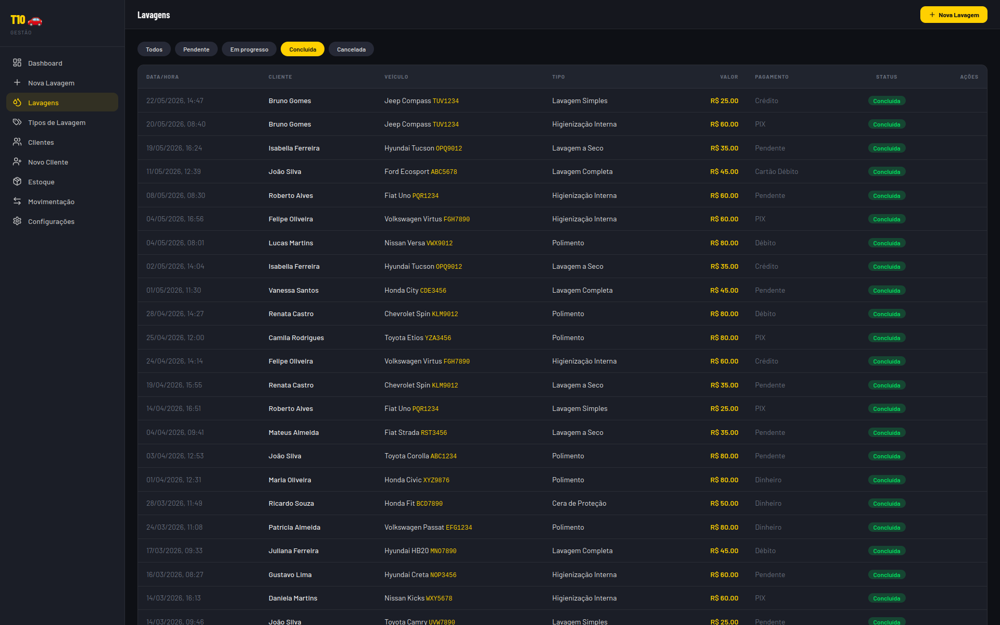
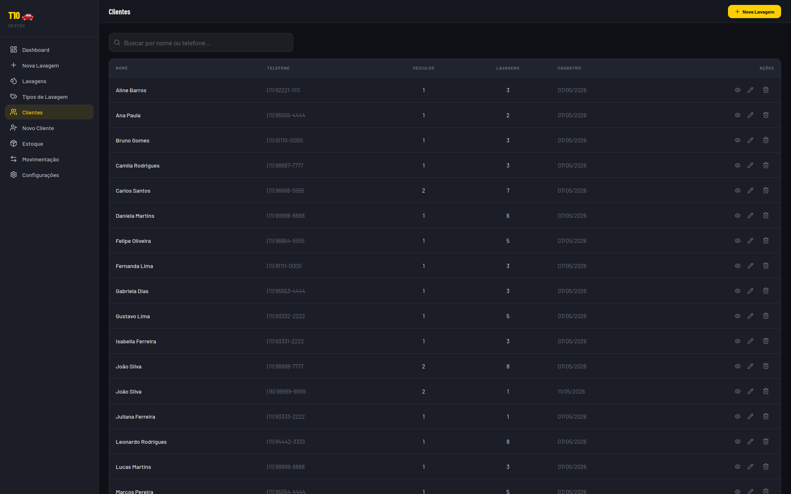
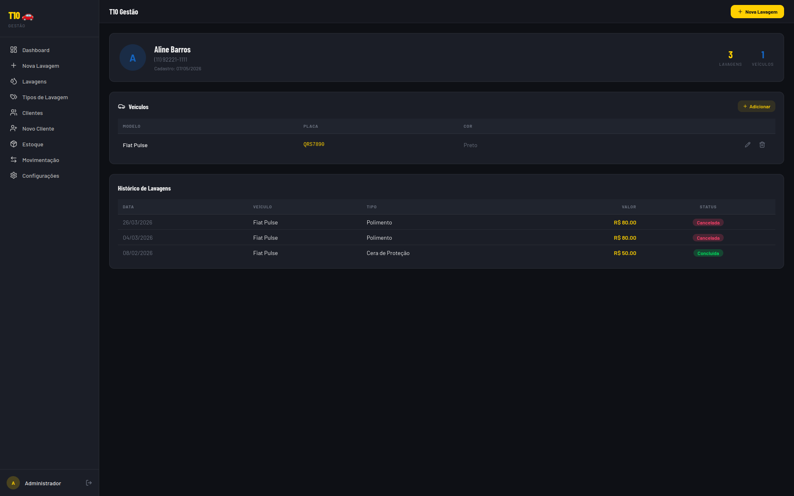

# 🌊 Wash Wizard 
**Sistema Fullstack de Gestão & Business Intelligence (BI) para Centros de Estética Automotiva**  
*Versão Acadêmica & Empresarial (Arquitetura Local / SQLite / Analytics)*

[](https://reactjs.org/)
[](https://nodejs.org/)
[](https://www.sqlite.org/)
[](#)

---

O **Wash Wizard** é uma plataforma *fullstack* profissional desenvolvida para transformar a gestão operacional e estratégica de centros de estética automotiva, lava-jatos e oficinas de detalhamento (*car detailing*). A solução combina o controle de fluxo de pátio em tempo real com um **Módulo de Data Analytics & BI Prático**, traduzindo dados transacionais brutos em indicadores acionáveis para tomada de decisão rápida e assertiva.

Projetada com uma arquitetura local-first e resiliente, a aplicação opera com Node.js e SQLite embutido, eliminando dependências de nuvem e garantindo alta performance, privacidade total dos dados e portabilidade completa via exportação/importação modular em CSV.

📄 **[Acesse a Documentação Gráfica Completa (docs.html)](./docs.html)**

---

## 📑 Índice

1. [Visão Geral e Funcionalidades](#-visão-geral-e-funcionalidades)
2. [Módulo de Data Analytics & BI Prático](#-módulo-de-data-analytics--bi-prático)
3. [Estudo de Caso & Validação em Campo](#-estudo-de-caso--validação-em-campo)
4. [Arquitetura e Desempenho Técnico](#-arquitetura-e-desempenho-técnico)
5. [Stack Tecnológico](#-stack-tecnológico)
6. [Estrutura do Repositório](#-estrutura-do-repositório)
7. [Guia de Inicialização](#-guia-de-inicialização)
8. [Gerenciamento de Banco de Dados e Backups](#-gerenciamento-de-banco-de-dados-e-backups)
9. [Segurança e Autenticação](#-segurança-e-autenticação)
10. [Próximos Passos](#-próximos-passos)
11. [Autores e Licença](#-autores-e-licença)

---

## 🚀 Visão Geral e Funcionalidades

O sistema provê o controle ponta-a-ponta do fluxo operacional e estratégico:

- **Gestão de Clientes e Veículos:** Cadastro unificado de proprietários e múltiplos veículos com integridade relacional estrita (deleção em cascata e histórico unificado).
- **Controle de Lavagens (Workflow de Pátio):** Acompanhamento de status em tempo real (`pendente`, `em_progresso`, `concluida`, `cancelada`) com fila operacional rápida.
- **Gestão de Estoque e Suprimentos:** Controle de saldo, ponto de pedido (`estoque_minimo`) e histórico de movimentações (entradas e saídas com transações atômicas).
- **Módulo de Business Intelligence (BI):** Painel executivo consolidado com KPIs em linguagem natural, séries temporais e painel de ações gerenciais.
- **Sistema de Backup Resiliente:** Importação e exportação de todas as entidades relacionais via CSV com allowlist de colunas e integridade referencial.
- **RBAC (Role-Based Access Control):** Controle estrito de acesso entre perfis Operador e Administrador, validado no backend via JSON Web Token (JWT).

---

## 📊 Módulo de Data Analytics & BI Prático

Diferente de dashboards genéricos com métricas estáticas ou jargões complexos de ciência de dados, o Wash Wizard organiza o painel gerencial em **4 pilares práticos de decisão**:

1. **Saúde Financeira da Operação:**
   - Faturamento semanal líquido de atendimentos finalizados.
   - Volume total de lavagens concluídas nos últimos 7 dias.
   - **Ticket Médio** por veículo atendido ($\text{Receita} \div \text{Qtd Lavagens Concluídas}$).
   - **Comparativo Percentual Temporal:** Indicador dinâmico de crescimento ou retração contra o período anterior (semana atual vs. semana anterior).
2. **Análise de Mix de Serviços (Produtividade vs. Rentabilidade):**
   - Comparativo visual entre **Volume de Atendimentos** (% da fila) e **Faturamento Gerado** (% da receita total).
   - Identificação imediata do *Serviço Líder de Fila* (mais procurado) versus o *Campeão de Lucro* (maior margem para estratégias de *upsell*).
3. **Gestão Preditiva de Suprimentos (Runway de Estoque):**
   - Monitoramento contínuo de insumos que cruzaram o ponto de pedido (`quantidade <= estoque_minimo`).
   - Cálculo dinâmico do consumo médio diário com base no histórico real de saídas (`movimentacoes`).
   - Projeção de esgotamento em dias (*Runway*), classificando itens em alertas intuitivos: `🔴 Zerado! Repor já`, `🔴 Acaba em ~X dias`, `🟡 Acaba em ~X dias` e `⚪ Abaixo do mínimo`.
4. **Retenção e Recorrência de Clientes:**
   - **Índice de Fidelização:** Percentual de clientes que já retornaram duas ou mais vezes à oficina.
   - **Radar de Clientes Ausentes (> 30 dias):** Identificação dos clientes habituais que não comparecem há mais de um mês.
   - **Reengajamento em 1 Clique (WhatsApp):** Disparo de link direto para a API do WhatsApp (`wa.me`) com mensagem amigável pré-formatada para resgatar o cliente.

---

## 🔬 Estudo de Caso & Validação em Campo

Embora o Wash Wizard tenha sido concebido como uma arquitetura genérica e configurável para qualquer estabelecimento de estética automotiva, sua validação prática foi conduzida em ambiente real de produção no **Lava Rápido Maquininha**, sob gestão do proprietário **Sr. Reinaldo**.

Essa validação em campo constitui o núcleo prático do **Projeto Integrador do curso de Engenharia de Computação da UNIVESP (Polo Sertãozinho/SP)**. Os testes operacionais com o proprietário demonstraram a importância de traduzir queries analíticas complexas em ações imediatas de negócio (ex: alerta de recompra de shampoo antes do término do estoque e reativação ativa de clientes via mensagem instantânea).

---

## 📸 Telas da Aplicação (Demonstração)

Abaixo estão algumas capturas de tela ilustrando a interface da solução, desenvolvida para proporcionar uma ótima experiência e facilidade de gestão:

### Dashboard Principal
Visão financeira e operacional com métricas e gráficos dinâmicos.
<div align="center">
  
  
</div>

### Gestão de Lavagens
Painel para acompanhamento de status de serviços.
<div align="center">
  
</div>

### Gestão de Clientes
Listagem completa e painel de edição detalhado do cliente e seus veículos.
<div align="center">
  
  
</div>

---

## 📐 Arquitetura e Desempenho Técnico

A aplicação utiliza o padrão **Client-Server** desacoplado em um repositório *Monorepo*, orquestrado por scripts padronizados de desenvolvimento e produção.

```text
[Frontend: React 18 SPA] <---(REST API JSON / Porta 3001)---> [Backend: Node.js + Express]
         |                                                            |
(Vite Dev Server: Porta 8080)                                (SQLite Engine: wash_wizard.db)
```

### Evolução Arquitetural de BI (Otimização Server-Side):
Nas iterações iniciais, o cálculo de métricas era realizado no navegador do cliente através de filtros em memória (`useMemo`) após download de todas as tabelas transacionais brutas. Na evolução analítica atual, implementou-se a **centralização analítica via SQL**:
- **Descentralização e Eficiência:** O endpoint analítico `GET /api/dashboard/stats` consolida todos os 4 pilares de negócio diretamente no SQLite através de consultas otimizadas com *Common Table Expressions* (CTEs), funções de data (`julianday`, `date`) e agregações relacionais indexadas.
- **Payload Ultraleve:** O tráfego de rede para carregar o dashboard foi reduzido de centenas de kilobytes (múltiplas tabelas completas) para um **JSON agregado de apenas ~1.2 KB**.
- **Latência de Consulta:** Tempo de resposta da API analítica **inferior a 30 ms**, assegurando carregamento instantâneo mesmo em hardware modesto ou conexões móveis no pátio.

### Decisões Arquiteturais Complementares:
- **Code-Splitting & Lazy Loading:** Roteamento com `React.lazy()` e `Suspense`, garantindo que o bundle inicial do frontend carregue em frações de segundo.
- **Acessibilidade Gráfica (A11y):** Gráficos Recharts renderizados com a paleta de cores Okabe-Ito (inclusiva para daltônicos) e espelhamento em tabelas semânticas ocultas (`ChartDataTable`) para leitores de tela.
- **Roteamento Protegido:** Validação de sessão ativa via JWT tanto no cliente quanto em cada camada de middleware do servidor.

---

## 💻 Stack Tecnológico

### Frontend
- **React 18** (TypeScript, Componentização e Hooks Avançados)
- **Vite** (Build Tool de alta performance e HMR ultrarrápido)
- **Tailwind CSS** & **shadcn/ui** (Design System modular e estilização utility-first)
- **Recharts** (Visualização Gráfica de Dados com paleta Okabe-Ito e A11y)
- **Lucide React** (Iconografia semântica e consistente)

### Backend
- **Node.js, Express** (Servidor HTTP RESTful, Middlewares de Autenticação e Roteamento)
- **SQLite3 (Queries Analíticas com CTEs)** (Motor de Banco de Dados Relacional Embutido com alta performance local)
- **JSON Web Token (JWT) & bcryptjs** (Autenticação Stateless, RBAC e Criptografia segura)
- **Multer & CSV-Parse** (Processamento e ETL de arquivos de backup com validação de cabeçalhos)

---

## 📁 Estrutura do Repositório

```bash
wash-wizard/
├── frontend/               # Single Page Application (Client-Side)
│   ├── src/
│   │   ├── components/     # UI components (shadcn) e visuais
│   │   ├── pages/          # Rotas principais (Lazy loaded)
│   │   └── services/       # Módulos de conexão com a API
│   ├── vite.config.ts      # Configurações do empacotador
│   └── package.json        
├── backend/                # RESTful API (Server-Side)
│   ├── server.js           # Ponto de entrada, Middlewares e Rotas
│   ├── db.js               # Conexões e inicialização do SQLite
│   ├── config.js           # Segredo JWT e configurações de auth
│   ├── middleware/auth.js  # requireAuth / requireAdmin
│   ├── schema.sql          # DDL e Constraints (versionado no repo — ver nota abaixo)
│   └── package.json        
├── backups/                # Diretório automatizado para exports CSV
├── docs.html               # Documentação interativa
├── ROADMAP.md              # Planejamento da próxima fase (Data Science / Analytics)
├── package.json            # Orquestrador Root (Scripts concurrently)
└── wash_wizard.db          # Arquivo do Banco de Dados Relacional (gerado localmente, não versionado)
```

> **`backend/schema.sql` é versionado no repositório**, ao contrário do arquivo `.db` em si. É a partir dele que `backend/db.js` inicializa o banco do zero (`CREATE TABLE ... IF NOT EXISTS`) na primeira execução, garantindo que um clone limpo do projeto suba sem depender de um dump de dados.

---

## ⚙️ Guia de Inicialização

### Pré-requisitos
- Node.js `v18.0.0` ou superior.
- NPM (Node Package Manager).

### Instalação (Método Monorepo)

O projeto contém um comando unificado para baixar dependências para a raiz, frontend e backend simultaneamente.

```bash
# 1. Clone o repositório
git clone https://github.com/t10-univespsertaozinho/t10-wash-wizard.git
cd t10-wash-wizard

# 2. Instale todas as dependências da infraestrutura
npm run install:all

# 3. Configure as variáveis de ambiente
cp frontend/.env.example frontend/.env
cp backend/.env.example backend/.env
# Edite backend/.env e defina um JWT_SECRET próprio (obrigatório fora de um ambiente
# de desenvolvimento descartável — sem ele, o servidor gera um segredo aleatório a
# cada boot e invalida sessões existentes a cada restart)

# 4. Gere o banco local com dados de exemplo (usuários admin/operador inclusos)
cd backend && node seed.js && cd ..
```

### Inicialização e Ambiente de Desenvolvimento

```bash
# Inicia simultaneamente o Back (3001) e Front (8080)
npm run dev
```
*(Após o servidor Vite inicializar, pressione `o` + `Enter` no terminal para abrir automaticamente a aplicação no navegador)*

**Acessos Locais:**
- **Web App:** `http://localhost:8080`
- **Backend API:** `http://localhost:3001/api`

---

## 🗄️ Gerenciamento de Banco de Dados e Backups

O modelo transacional é estritamente gerenciado no SQLite com `PRAGMA foreign_keys = ON`. A modelagem original, proveniente de serviços em nuvem (como Supabase/Firebase), teve tipagens convertidas para o ambiente local (`UUID` e `Timestamps` manipulados como `TEXT` formato ISO-8601).

### Sistema de Backup (CSV)
Visando portabilidade dos dados, a aplicação dispõe de rotinas de serialização:
- **Exportação (Dump):** O administrador pode emitir artefatos `.csv` que mapeiam integralmente o status relacional.
- **Importação (Restore):** A API injeta registros respeitando estritamente a árvore de dependências do esquema (`Usuários -> Clientes -> Veículos -> Lavagens`), utilizando `BEGIN TRANSACTION` para garantir falha segura sem perda de integridade do modelo.

---

## 🔒 Segurança e Autenticação

A autenticação e a autorização são reforçadas pelo **backend**, não apenas simuladas no cliente:

- **Autenticação JWT:** `POST /api/auth/login` valida a senha contra o hash `bcrypt` armazenado em `users.password_hash` e emite um token JWT (expira em 8h). Toda rota de `/api/*` — exceto o login — exige o header `Authorization: Bearer <token>`, validado pelo middleware `requireAuth`.
- **RBAC (Role-Based Access Control):** aplicado tanto no roteamento do frontend quanto em cada endpoint do backend (`requireAdmin`), então um usuário `operador` não contorna a restrição chamando a API diretamente.
  - **Público:** `/login`
  - **Operador:** Acesso à gestão de Clientes, Veículos, Lavagens e Dashboard `(/)`
  - **Admin:** Acesso adicional a Tipos de Lavagem, Estoque, Movimentações, Usuários e Configurações (Sistema de Backup)
- **CORS restrito:** o backend só aceita requisições da origem definida em `FRONTEND_URL`.
- **Outras proteções:** allowlist de colunas no import de CSV (previne SQL Injection via cabeçalho malicioso), transações atômicas nas movimentações de estoque, e mensagens de erro genéricas ao cliente (o detalhe real do SQLite fica só no log do servidor).

Detalhes completos, incluindo a matriz de permissões por rota, estão em [`SECURITY.md`](./SECURITY.md).

**Credenciais de exemplo (geradas por `backend/seed.js`, senhas configuráveis via `backend/.env`):**
- `admin@washwizard.com` / `admin123` (perfil `admin`)
- `operador@washwizard.com` / `operador123` (perfil `operador`)

---

## 🧭 Próximos Passos

A próxima fase do projeto foca em **Data Science e Analytics Avançado** sobre o histórico já registrado (lavagens, clientes, estoque): pipelines de ETL para um datamart analítico (Parquet/DuckDB), métricas como churn, LTV e tempo médio de atendimento, e modelos preditivos de demanda, gestão de estoque e segmentação de clientes (RFM).

Plano detalhado, com sequenciamento e dependências técnicas sugeridas, em [`ROADMAP.md`](./ROADMAP.md).

---

## 🎓 Autores e Licença

Desenvolvido pelo grupo acadêmico do **Projeto Integrador da UNIVESP**.

*Este código e seus ativos são de propriedade exclusiva para fins acadêmicos e para a instituição parceira de aplicação do projeto (Lava Rápido Maquininha). É expressamente proibida a reprodução, comercialização ou re-licenciamento deste software sob quaisquer circunstâncias sem a autorização prévia de todos os mantenedores originários.*
